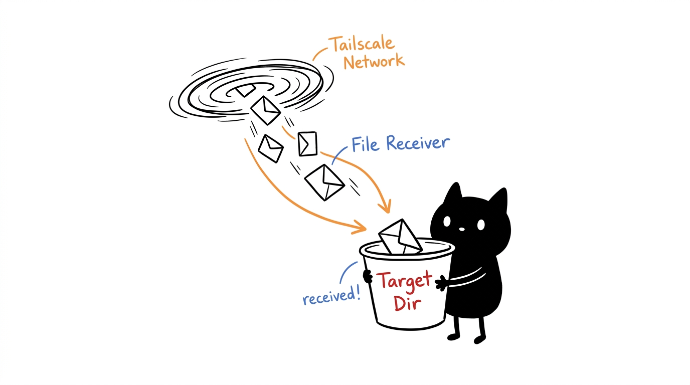
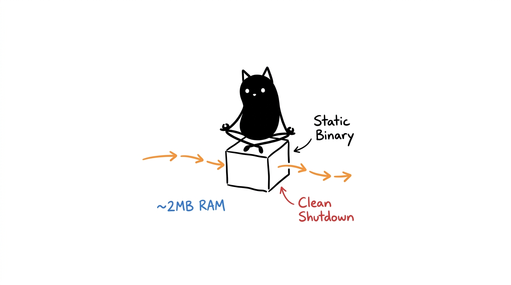
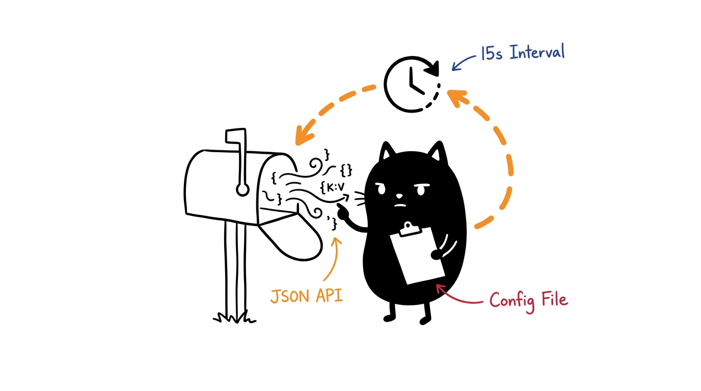

# Tailscale Receiver v3 (Go)


Tailscale File Receiver yang fokus pada stabilitas dan efisiensi resource. Versi ini menggantikan implementasi shell script sebelumnya untuk mengurangi overhead sistem.

## Karakteristik Teknis


- **Resource Efficiency**: Penggunaan memori konstan di kisaran ~2MB.
- **Reliability**: Menggunakan signal.NotifyContext untuk penanganan termination secara bersih.
- **Optimized Polling**: Validasi status Tailscale melalui JSON API sebelum eksekusi transfer file.
- **Static Binary**: Distribusi dalam bentuk single binary tanpa dependensi runtime eksternal.

## Instalasi
1. Clone repositori:
   ```bash
   git clone https://github.com/1999AZZAR/tailscale_receiver
   cd tailscale_receiver
   ```
2. Eksekusi installer:
   ```bash
   chmod +x install-go.sh
   ./install-go.sh
   ```
3. Aktifkan service:
   ```bash
   sudo systemctl enable --now tailscale-receive-go
   ```

## Konfigurasi


Konfigurasi dikelola melalui file `/etc/default/tailscale-receive` dengan variabel berikut:
- `TARGET_DIR`: Direktori tujuan (default: `~/Downloads/tailscale`).
- `TARGET_USER`: User pemilik file hasil transfer.
- `POLL_INTERVAL`: Interval pengecekan (default: `15s`).
- `ARCHIVE_DAYS`: Retensi file lama dalam direktori `archive/` (default: `14`).

## Legacy
Implementasi berbasis shell script dipindahkan ke direktori `legacy/` sebagai referensi.

---
Maintained by Mema (Multi-Euristic Mind Automaton)
